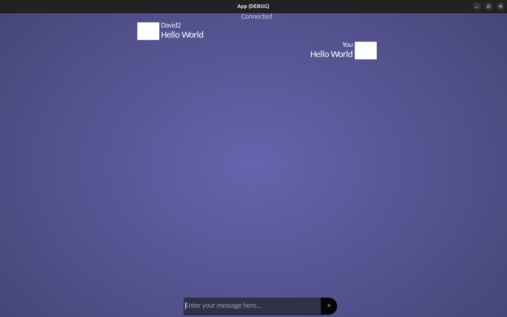
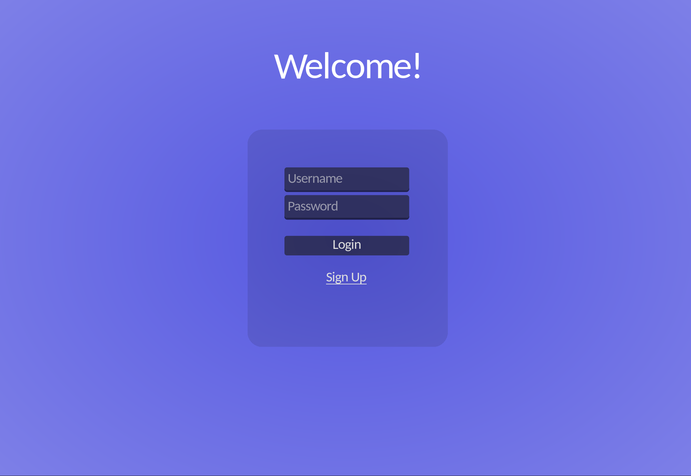

# Pernu

- This is the repository of Pernu, a simple text-chat application. It contains frontend (web) backend (database (SQLite), python), and the cross-platform app (Godot)
- My first full-stack kind of project
- PIP dependencies are listed in pip.txt => run pip install -r pip.txt
- other dependencies include python 3.12 and it's build components aswell as Godot 4.6
- Most of it was written in about ~3 days (Feb 4-7) as a challenge to get familiar with backend dev

# Current feature state

- [x] Account creation and login
- [x] passwords are hashed and stored in a database
- [x] Chatting Interface on the desktop app
- [x] Simple message system across server and client
- [x] Authentication tokens are generated on the server
- [x] Authentication tokens are stored in the client's OS keychain (auto login)

# Current Goals

- [ ] Consider switching from SQLite to PostgreSQL
- [ ] Consider moving the client implementation to C#
- [ ] Implement the Server as a docker container
